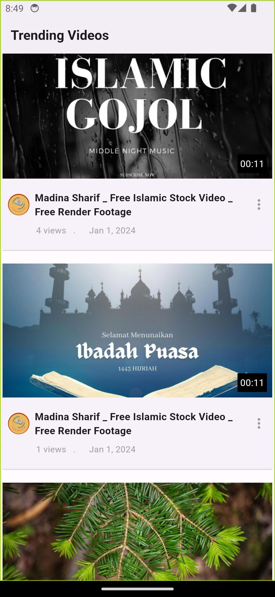

# qtech_video_player_task

## Features
- Video List.
- Video Player.
- State Management: Getx.
- Clean Code.

## Add the necessary dependencies to your pubspec.yaml file:

## Third-Party Services
- Chewie Player:
  The chewie package is used for the video play.

-Add the following dependency to your pubspec.yaml:

## Screenshots
 

## Android
 

 

 
 

